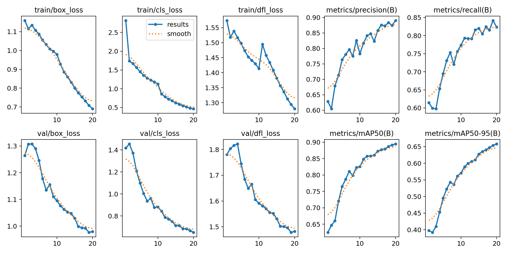
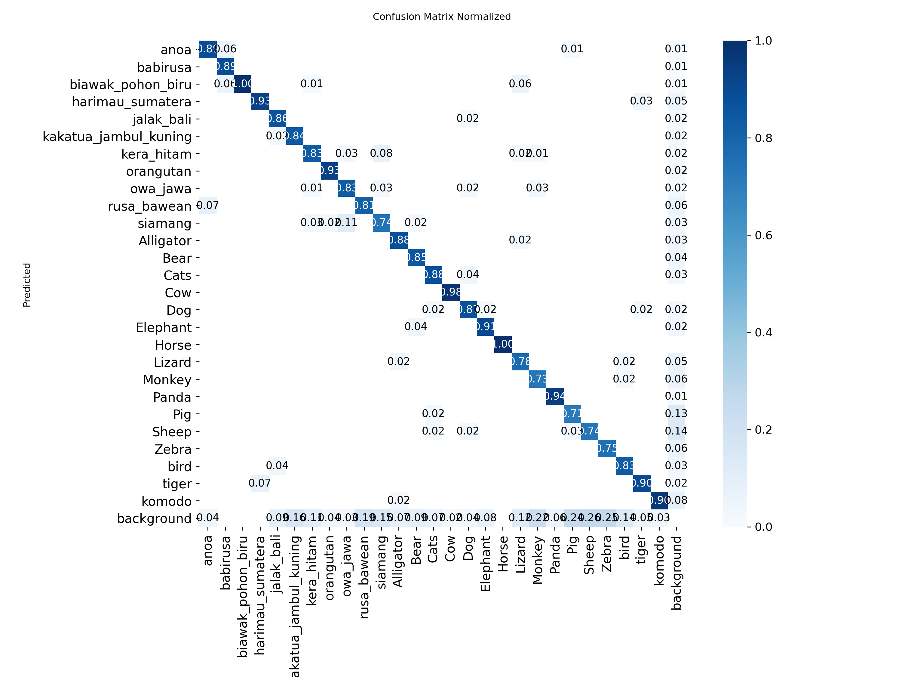
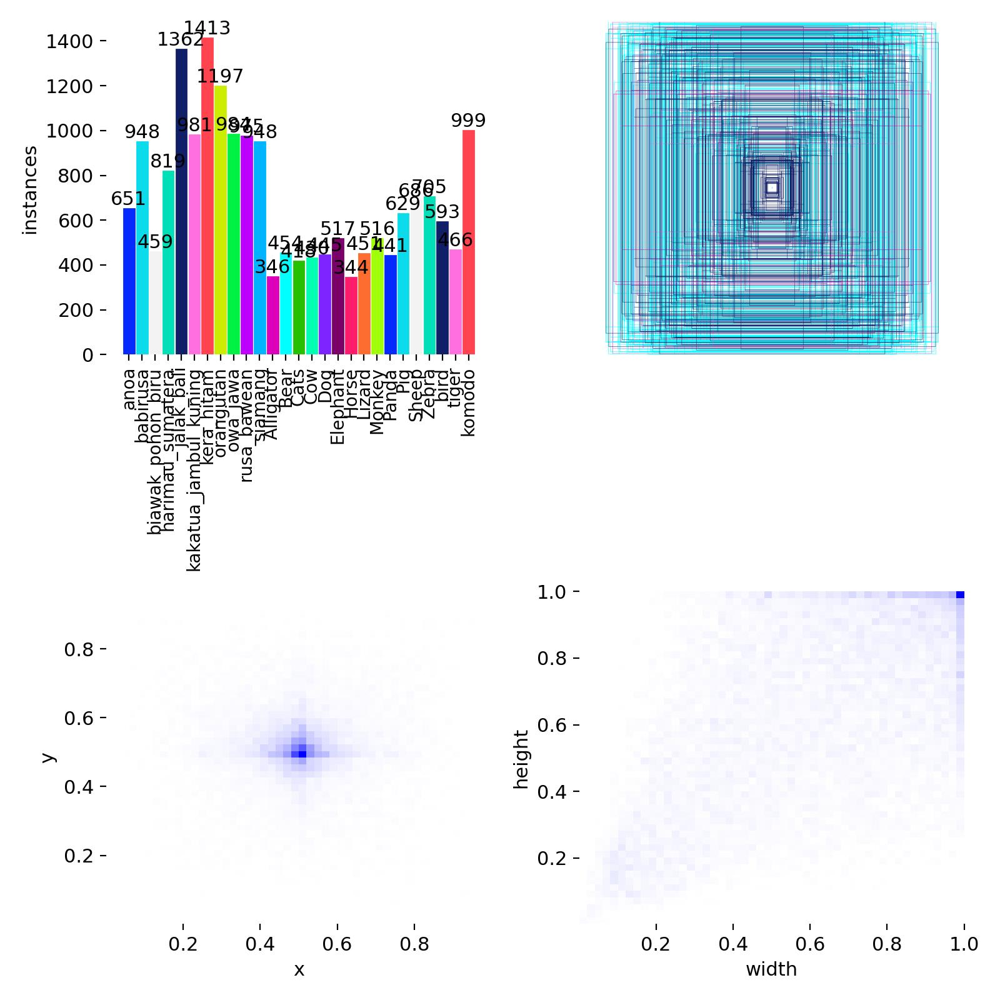

# Nusa Fauna: Deteksi Hewan Langka Indonesia

Website untuk mendeteksi hewan dari foto dan menampilkan status kelangkaannya secara instan. Pengguna mengunggah gambar, model YOLO mengenali hewannya, lalu website menggambar bounding box beserta status **Langka** atau **Tidak langka**.

**Demo live:** https://nusafauna.vercel.app

> Backend di-host di Render paket gratis. Kalau website baru dibuka setelah lama tidak dipakai, request pertama bisa butuh sekitar 1 menit karena server sedang "bangun".

## Fitur

- Unggah gambar lewat klik atau drag and drop (maks. 5 MB)
- Deteksi banyak hewan dalam satu gambar, lengkap dengan bounding box dan confidence
- Status kelangkaan otomatis untuk 12 satwa Indonesia
- Tampilan responsif (desktop dan mobile)

## Tech Stack

| Bagian | Teknologi |
|---|---|
| Model | YOLO (Ultralytics), PyTorch |
| Backend | FastAPI, Uvicorn, Pillow |
| Frontend | HTML, CSS, JavaScript (tanpa framework) |
| Deployment | Render (backend), Vercel (frontend) |

## Kelas yang Dikenali

Model dilatih untuk **27 kelas**:

- **12 satwa Indonesia (status: Langka):** anoa, babirusa, biawak pohon biru, harimau sumatera, jalak bali, kakatua jambul kuning, kera hitam, orangutan, owa jawa, rusa bawean, siamang, komodo
- **15 hewan umum (status: Tidak langka):** alligator, bear, cats, cow, dog, elephant, horse, lizard, monkey, panda, pig, sheep, zebra, bird, tiger

Hewan umum dimasukkan supaya model bisa membedakan satwa langka dari hewan yang mirip (misalnya monkey vs kera hitam).

## Performa Model

Metrik pada validation set di epoch terakhir (epoch 20 dari 20):

| Metrik | Nilai |
|---|---|
| Precision | 0.891 |
| Recall | 0.823 |
| mAP50 | 0.895 |
| mAP50-95 | 0.658 |

Semua metrik terus naik sampai epoch terakhir, dan loss validasi ikut turun, jadi belum terlihat tanda overfitting di 20 epoch ini. Training masih bisa dilanjutkan lebih lama untuk melihat apakah hasilnya masih membaik.

**Kurva training:**



**Confusion matrix (normalized):**



**Distribusi label dataset:**



### Keterbatasan

- Jumlah data per kelas tidak seimbang (kira-kira 340 sampai 1.400 instance per kelas).
- Beberapa kelas masih lebih lemah, dengan nilai diagonal confusion matrix sekitar 0.71 sampai 0.75: pig, monkey, siamang, sheep, dan zebra.
- Pada beberapa kelas, cukup banyak objek yang tidak terdeteksi sama sekali (dianggap background).
- Hasil terbaik didapat dengan foto yang jelas dan hewan terlihat utuh di dalam frame.

## Struktur Repo

```
Nusa-Fauna1/
├── Backend/
│   ├── main.py                  # API FastAPI (endpoint /predict)
│   ├── best_GabunganFinal.pt    # bobot model
│   └── requirements.txt
├── Front end/
│   └── index.html               # antarmuka website
└── docs/                        # gambar evaluasi model
```

## API

`POST /predict` dengan `multipart/form-data`, field `file` berisi gambar.

Contoh respons:

```json
{
  "hasil": [
    { "hewan": "Monkey", "status": "Tidak langka", "confidence": 83.27 }
  ],
  "boxes": [
    {
      "hewan": "Monkey",
      "status": "Tidak langka",
      "confidence": 83.27,
      "box": [42.44, 6.92, 304.39, 341.94]
    }
  ]
}
```

Dokumentasi interaktif (Swagger) ada di `/docs` pada URL backend.

## Menjalankan Secara Lokal

**Backend**

```bash
cd Backend
pip install -r requirements.txt
uvicorn main:app --reload
```

Backend jalan di `http://localhost:8000`.

**Frontend**

Buka `Front end/index.html` di browser. Saat dibuka dari `localhost`, website otomatis memakai backend lokal. Di internet, website memakai backend di Render.

## Deployment

- **Backend:** Render Web Service, Root Directory `Backend`, Start Command `uvicorn main:app --host 0.0.0.0 --port $PORT`
- **Frontend:** Vercel, Root Directory `Front end`, Framework Preset `Other`

## Author

Vincent Vibhava Pranata
